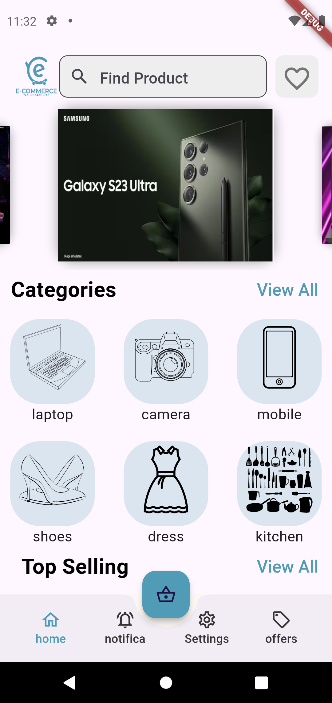
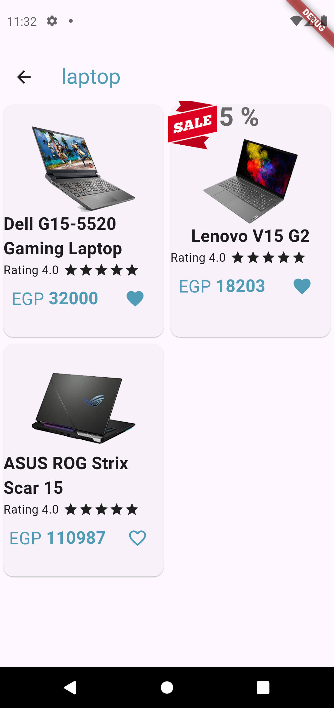
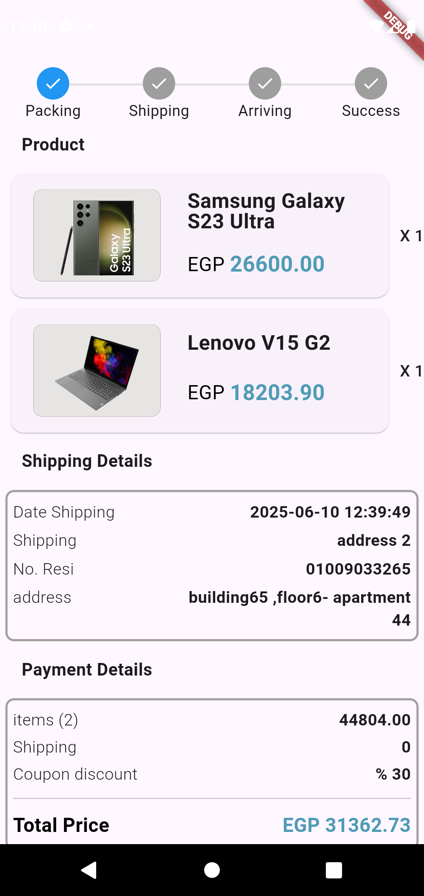
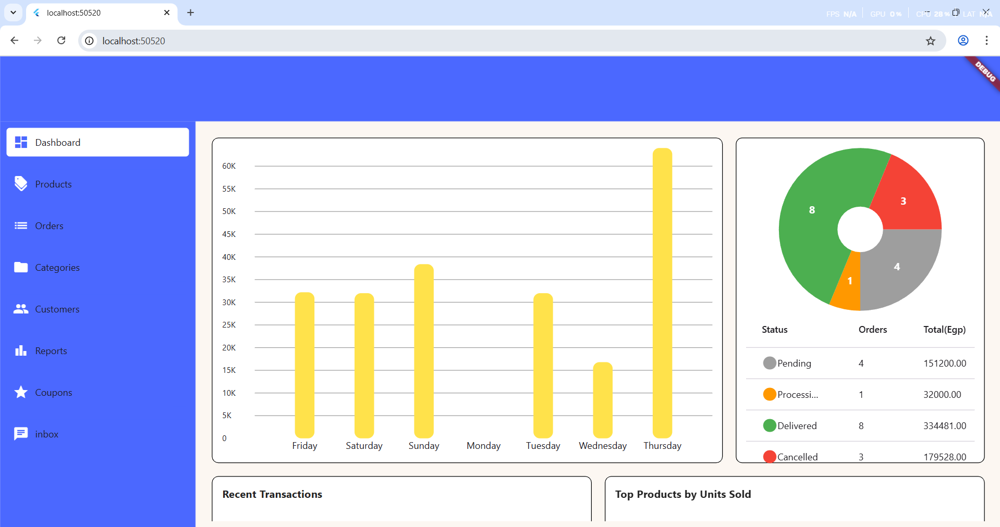

# Frontend Flutter Developer
## Download my CV for contact info [..here](https://drive.google.com/file/d/1mBkWsyDFXD4Knd-rnPa__1kVsyaGN5IY/view?usp=drive_link)
## My Linkedin profile [[..here](https://www.linkedin.com/in/ahmed-mohamed-ali-6aa3492b5/)
## About me:
- A flutter frontend developer with a strong foundation in clean architecture principles. Passionate about crafting highperformance, user-friendly applications. Experienced in Architecture TDD and BLOC state management. Seeking opportunities to
contribute to innovative projects and collaborate with talented teams. 
	
## Projects:

<table>
  <tr>
    <td>
<h4><a href="https://github.com/ahmiidmoali/web_dashboard">Web Dashboard App</a></h4>
	    
- Clean Architecture, responsive design, Bloc , php rest Api, Get it .....
- Features: displaying charts about users & orders activties ,products and cateogories CRUD operations - approving and preparing
orders
    </td>
      </tr>
<tr>
    <td>
<h4><a href="https://github.com/ahmiidmoali/ecommerce_app">Ecommerce App</a></h4>
	    
- Clean Architecture, Bloc , php rest Api, Get it .....
- Features: Email authentication , product CRUD operations, and essential user actions like cart management, checkout, and selling.
Integrated a responsive app notification system for enhanced user communication.
    </td>
      </tr>
  
   <tr>
    <td>
<h4><a href="https://github.com/ahmiidmoali/meeting_app">Meeting App</a></h4>
	    
- Bloc , php rest Api, Clean Architecture , Get it, Agora. .....
- Features: Email authentication , all meeting apps features like joining using code, history and setting schedule for future events 
    </td>
      </tr>
    <tr>
    <td>
<h4><a href="https://github.com/ahmiidmoali/whatsapp_clone">WhatsApp Clone</a></h4>
	    
- Clean Architecture,Firebase, Bloc , Get it .....
- Features: mobile number authentication , single chats for all kind of messages ‘streaming data’, status feature and calling.
    </td>
      </tr>

    <tr>
    <td>
<h4><a href="https://github.com/ahmiidmoali/instagram_clone">Instagram Clone App</a></h4>
- Bloc, php rest Api , Clean Architecture. ..... 
- Features: Authentication, Personalized Profile page, Interactive posting , Following and Followers , Explore &Home Page
    </td>
      </tr>
  <tr>
     <td>
<h4><a href="https://github.com/ahmiidmoali/Ecommerce-App-">Ecommerce App</a></h4>
- GetX , php rest Api , MVC architecture.
- Independently developed both the frontend user interface and backend API,encompassing user authentication, product
CRUD operations, and essential user actions like cart management, checkout, and selling. Integrated a responsive app notification
system for enhanced user communication
    </td>
  </tr>
  <tr>
    <td>
<h4><a href="https://github.com/ahmiidmoali/ecommerce_admin">Admin Ecommerce-App App</a></h4>
	    
- GetX , php rest Api , MVC architecture..
- Features: products and cateogories CRUD operations - approving and preparing orders .
    </td>
      </tr>
  </table>
## Screenshots
### Meeting App  [  ...More >>](https://github.com/ahmiidmoali/enhanced_meeting_app/blob/main/README.md)
<table>
  <tr>
    <td></td>
     <td></td>
     <td></td>
  </tr>
   </table>
### Web Dashboard  [  ...More >>](https://github.com/ahmiidmoali/web_dashboard/blob/main/README.md)
<table>
  <tr>
    <td></td>
     <td></td>
    
  </tr>
  </table>
  
### ecommerce App  [  ...More >>](https://github.com/ahmiidmoali/ecommerce_app/blob/main/README.md)
<table>
  <tr>
    <td></td>
     <td></td>
     <td></td>
  </tr>
   </table>
