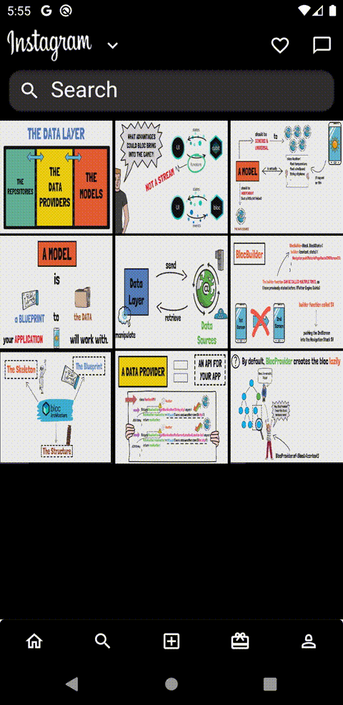

# Frontend Flutter developer  [   MyLinkedin](https://www.linkedin.com/in/ahmed-mohamed-ali-6aa3492b5/)

## Education:
- Flutter developer self-studying 
- Al-Azhar University– Cairo civil engineering (2014-2019)
  
 ## Languages:
Arabic - English -  German		

## Technical Skills
•	Dart – PHP – MySQL.
•	Bloc/ GetX / Provider/Stateful …. Flutter State Management.
•	Clean code based on clean Architecture.
•	Data Structure & Algorithms.
•	UI design principles -SOLID-Design Patterns - Architecture Patterns.
•	Unit Testing TDD.
•	PHP Rest API’s – Json.
•	Git _ Github.
•	php MySQL database.
•	my sqflite with Flutter.
•	Third-Party Libraries in flutter and Dart Packages.
•	Localization - Authorization.
•	Responsive Screens.
•	pickimage – pickfile – upload files.
•	Shared preference – caching API.
•	Firebase with flutter (Notifications -FireStoreRealtime DB-Authentication).
•	Social Media Authentication.
•	Google API’s like google maps.
•	Local Storage, Files and Cache Memory.       		

## Projects:
###  [Instagram Clone App backend&frontend ](https://github.com/ahmiidmoali/instagram_clone).

#### Features From The App .

###  [Ecommerce App backend&frontend](https://github.com/ahmiidmoali/Ecommerce-App-).

#### Features From The App .

